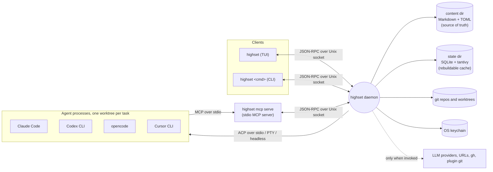
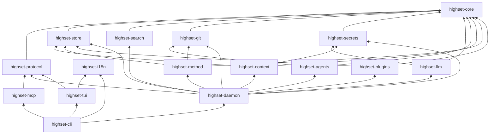
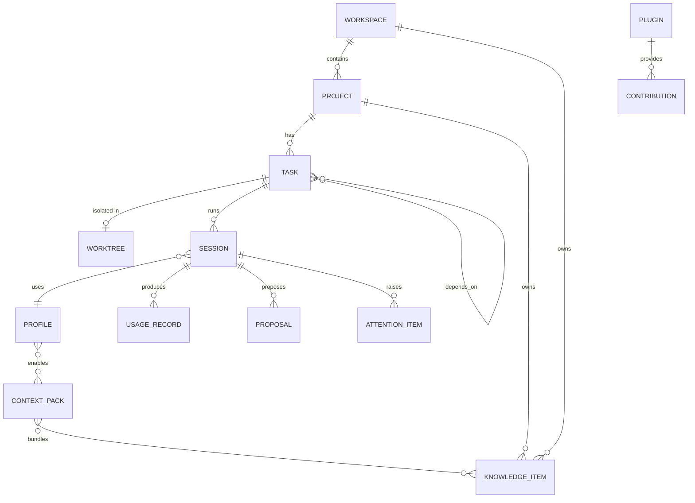
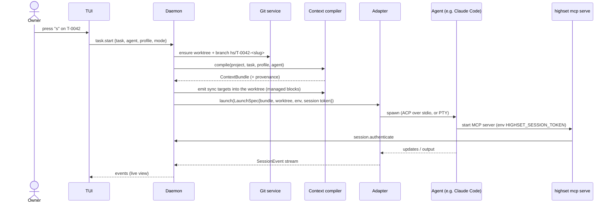
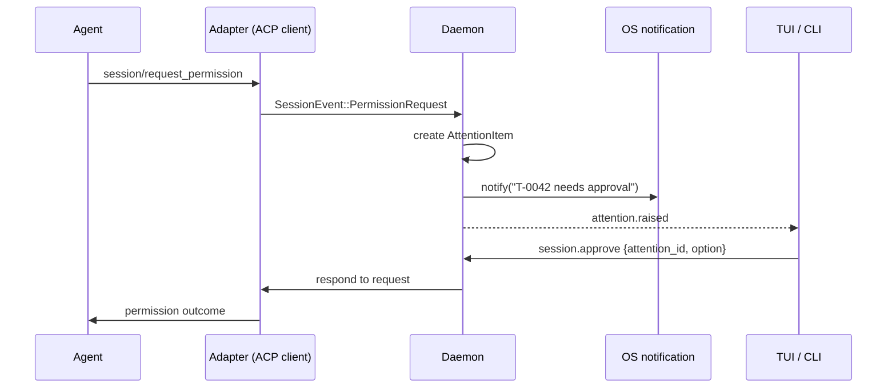

# HighSet architecture

Status: Draft 1 · 2026-10-03 · Decisions referenced as ADR-NNNN live in [`decisions/`](decisions/).

## 1. Shape of the system

HighSet is **one Rust binary, `highset`**, that runs in four roles:

| Role | Command | Lifetime | Talks to |
|---|---|---|---|
| Daemon | `highset daemon run` (auto-started) | Long-running, one per user | Files, SQLite, git, agents, keychain, LLM providers |
| TUI | `highset` (no args) | Interactive | Daemon over the Unix socket |
| CLI | `highset <command>` | One-shot | Daemon over the Unix socket |
| MCP server | `highset mcp serve` (spawned by agents) | Per agent session | Daemon over the Unix socket; the agent over stdio |

The daemon owns all state and all side effects. Clients are thin (ADR-0004).



## 2. Crates

Cargo workspace (ADR-0002). Every crate has `#![forbid(unsafe_code)]` and a `README.md` stating its purpose and allowed dependencies.

| Crate | Responsibility | Lane |
|---|---|---|
| `highset-core` | Domain types and IDs, task status machine, events, flow types, the `ContextBundle` IR, config model, `paths`. No async, no IO except path resolution. | core |
| `highset-protocol` | JSON-RPC 2.0 messages, typed method and event catalog, framing, error codes, async client. | core |
| `highset-store` | Content files (Markdown/TOML read/write, atomic, round-trip safe); SQLite cache and migrations; file watcher; backups. | core |
| `highset-search` | tantivy full-text index; nucleo fuzzy helpers. | platform |
| `highset-git` | git CLI wrapper: worktrees, branches, commits, diffs, merges, `gh` PRs. | agents |
| `highset-agents` | Adapter trait and registry; ACP client; PTY runner; headless runners; adapters for Claude Code, Codex, opencode, Cursor CLI; transcript harvesters. | agents |
| `highset-context` | Knowledge resolution (levels, audience), packs, profiles resolution, context compiler, sync-target emitters, mentions. | context |
| `highset-mcp` | `highset mcp serve`: MCP server (rmcp) that proxies to the daemon with a session token. | context |
| `highset-secrets` | Keychain access; redaction engine. | platform |
| `highset-llm` | Provider clients (Anthropic, OpenAI, OpenAI-compatible, agent-headless) and internal task prompts. | platform |
| `highset-method` | Flows, gates, checks, templates, rituals, ADR/changelog/journal writers. | platform |
| `highset-plugins` | Plugin manifests, install/update/remove, lockfile, permission review, Claude Code plugin import. | platform |
| `highset-i18n` | Fluent bundles (en, es), language resolution. | infra |
| `highset-daemon` | Wiring: socket server, service registry, event bus, session supervisor, attention, hooks engine, notifications, scheduler, backups. | core + all lanes (each in `services/<area>/`) |
| `highset-tui` | ratatui application. | tui |
| `highset-cli` | The `highset` binary: clap command tree, dispatch to TUI/daemon/MCP. | core |
| `highset-testkit` (dev) | Test helpers: temp homes and repos, daemon spawner, scenario builders. | infra |
| `tools/fake-agent` (dev) | Test double that speaks ACP, PTY and headless JSON according to scripted scenarios. | infra |
| `xtask` (dev) | Repo automation: dependency-rule check, i18n parity, perf scripts, docs generation. | infra |

### Dependency rules

Enforced by `cargo run -p xtask -- check-deps` in CI.



Rules:

1. `highset-core` depends on no internal crate. Only `serde`, `thiserror`, `ulid`, `time` and similar pure crates.
2. Clients (`highset-tui`, `highset-mcp`) depend on `highset-protocol`, never on service crates. They only reach state through the daemon.
3. Service crates never depend on each other sideways unless the graph above shows it. Cross-service coordination happens in `highset-daemon`.
4. `highset-agents` never depends on `highset-context`. Adapters receive a ready `ContextBundle` (a core type) in their `LaunchSpec`.

## 3. Data model



Full field definitions: [`specs/core-domain.md`](specs/core-domain.md). File formats: [`specs/storage.md`](specs/storage.md).

## 4. Storage

There are two homes and one rule (ADR-0007, ADR-0008, ADR-0022):

- **Content** is plain files and the only source of truth. It is safe to put in git or a synced folder.
- **State** is caches and runtime files. It is local only, and deleting it loses nothing.

```
~/.highset/                       HIGHSET_HOME (overridable)
├── config.toml                   global config (layer 1)
├── content/                      relocatable via `content_dir`; sync-safe
│   ├── workspaces/<ws>/          workspace.toml + workspace-level context/, knowledge/, packs/, profiles/
│   ├── context/                  global convention files
│   ├── knowledge/                global knowledge items (+ assets/)
│   ├── packs/<name>/pack.toml
│   ├── profiles/*.agent.md       user profiles (built-ins ship inside the binary)
│   ├── prompts/*.prompt.md
│   ├── skills/<name>/SKILL.md
│   ├── mcp/servers.toml          MCP server registry
│   ├── flows/*.toml  templates/  overrides of shipped flows and templates
│   ├── tasks/I-0001-*.md         global inbox (ideas captured outside any project)
│   ├── inbox/                    pending proposals (memory, knowledge, decisions, doc updates)
│   ├── journal/YYYY/MM/DD.md     daily work journal
│   ├── sessions/<project-id>/<session-id>/   session.toml, transcript.jsonl, summary.md, diff.patch, usage.jsonl
│   ├── plugins/<id>/ + plugins.lock
│   └── pricing.toml
├── state/                        local only, rebuildable
│   ├── highset.db                SQLite cache (WAL)
│   ├── search/                   tantivy index
│   ├── run/highset.sock          daemon socket (0600), daemon.lock
│   └── logs/
├── worktrees/<project>/<T-id>-<slug>/   default worktree root (configurable)
└── backups/YYYY-MM-DD.tar.zst

<project repo>/
├── .highset/
│   ├── project.toml              project id, workspace, linked repos, verify commands, overrides
│   ├── context/                  convention files: PROJECT.md, *.instructions.md, *.prompt.md, *.agent.md, skills/, MEMORY.md
│   ├── knowledge/  packs/  profiles/
│   ├── tasks/T-0001-<slug>.md
│   ├── local/                    gitignored: private knowledge and personal overrides
│   └── .gitignore
├── specs/NNN-<slug>/{spec,plan,tasks}.md   Spec Kit–compatible (configurable)
├── docs/decisions/NNNN-*.md               ADRs (MADR)
├── CHANGELOG.md                           Keep a Changelog
└── AGENTS.md, CLAUDE.md, …                generated managed blocks + your own content
```

Write discipline:

- Only the daemon writes content. The CLI and TUI ask the daemon.
- Writes are atomic: temp file, fsync, rename.
- A file watcher picks up external edits (`$EDITOR`, `git pull`) and refreshes caches within 1 s.
- Agents working in a worktree never write `.highset/` there. The worktree copy may be stale; agents use the MCP server for task and spec state, and sync targets deny those writes.

## 5. Concurrency model inside the daemon

- One tokio multi-thread runtime.
- **Actors** own resources. The store actor owns the single SQLite connection (a dedicated thread); each session has a supervisor task; the search actor batches tantivy commits; the git service serializes operations per repo.
- **Event bus.** A `tokio::sync::broadcast` channel of `core::Event`. Services publish; clients subscribe through `events.subscribe` with topic filters. Slow subscribers get lagged notifications and resync through a snapshot call. They never block publishers.
- **PTY output** goes to a per-session ring buffer. It is coalesced to at most 60 notifications per second per attached client.
- **No polling.** Work is driven by file watcher events, process IO, socket messages, and a single low-frequency scheduler for rituals and backups (at most one wakeup per minute).

## 6. Key flows

### 6.1 Start an agent on a task



### 6.2 Agent asks for permission



### 6.3 Session ends → summary → memory proposals

1. The adapter emits `Ended`. The supervisor writes the final `diff.patch` (git diff of the worktree against base) and closes `transcript.jsonl`.
2. The daemon runs the internal tasks `summarize_session` and `extract_memory` through `highset-llm`. Their outputs are redacted.
3. `summary.md` is written. Proposals land in `content/inbox/`. The journal gets an entry. Attention: "T-0042 finished".
4. The owner approves proposals in the inbox view. Approved memory is appended to `.highset/context/MEMORY.md` (or a memory item), with provenance.

### 6.4 Context compilation

See [`specs/context-compiler.md`](specs/context-compiler.md). In short:

1. Gather layered config, the resolved profile, active packs, convention files at all levels, visible knowledge (levels plus audience), task and spec artifacts, and approved memory.
2. Order the material and apply a budget: always-on material goes inline, the rest is listed in an on-demand index served through MCP.
3. Produce a `ContextBundle` with provenance and a content hash.
4. Emitters write agent-specific files (managed blocks, owned keys only) and/or launch flags.

## 7. Agent integration

The `AgentAdapter` trait is in [`specs/agents.md`](specs/agents.md). Each adapter declares the modes it supports:

| Mode | Use | UI |
|---|---|---|
| ACP | Preferred. Structured messages, tool calls, diffs and permission requests (HighSet is the ACP *client*) | Structured session view |
| PTY | Fallback for any CLI. The real terminal UI, embedded | Embedded terminal pane |
| Headless | Automation and internal tasks (`claude -p`, `codex exec`) | Log view |

Native agent hooks (e.g. Claude Code notification hooks, Codex `notify`) call `highset hook signal …` to report "needs input" and "finished" precisely. Transcript harvesters read each agent's own session logs for usage and transcript import when the mode does not expose them.

## 8. Protocol

JSON-RPC 2.0 over a Unix domain socket, newline-delimited UTF-8 frames, versioned handshake. Method and event catalog: [`specs/daemon-protocol.md`](specs/daemon-protocol.md). The same API serves the TUI, the CLI, the MCP shim and user scripts (INT-2).

## 9. Extensibility

- **Declarative plugins (v0.1).** Folders with `highset-plugin.toml` that contribute skills, prompts, profiles, packs, convention files, MCP servers, hooks, shell commands and translations. Installed from git or local paths, pinned in a lockfile, with permissions approved by the user.
- **Claude Code plugins and Agent Skills** are imported into the same contribution model.
- **Code plugins (v0.2).** Out-of-process programs speaking JSON-RPC over stdio (the LSP/MCP pattern) for adapters, importers and integrations.
- **Hooks.** User commands run on HighSet events (session start/end, status change, pre-commit/merge, attention).

## 10. Security model (summary)

Full detail in [`specs/security.md`](specs/security.md).

- The socket is `0600` in the user's state dir. MCP sessions present a per-session random token.
- Secrets live only in the keychain, are referenced as `secret:<name>`, and are injected as env vars at launch. They never appear in generated files.
- Redaction runs before persisting anything derived from agent output.
- Agents run inside their worktree, under their own sandbox, with permission rules compiled from HighSet profiles.
- Plugins declare permissions; changes require re-approval.
- No network access except for user-invoked features. No telemetry.

## 11. Performance strategy

Budgets: [`specs/performance.md`](specs/performance.md).

- **Startup.** The TUI renders the first frame from a cached snapshot request (`ui.bootstrap`), then fills in lazily.
- **Rendering.** State store plus render-on-dirty, no fixed tick. PTY output is coalesced, and only visible panes are rendered.
- **Data.** SQLite in WAL mode with prepared statements; tantivy commits are batched; the fuzzy matcher (nucleo) works over cached candidate lists kept fresh by events.
- **Daemon.** Event-driven, with no polling loops. Heavy work (indexing, ingest, LLM tasks) runs off the request path.
- **Binary.** Release profile with thin LTO, `codegen-units = 1`, `strip = true`. Heavy optional features are behind cargo features if they threaten PERF-10.

## 12. Testing strategy

| Level | Tooling | Notes |
|---|---|---|
| Unit | `cargo test` | Pure logic in core, context, method, search |
| Golden | `insta` | Context bundles, emitted sync targets, standup reports, TUI snapshots (`TestBackend`) |
| Integration | `highset-testkit` + `tools/fake-agent` | Real daemon, temp `HIGHSET_HOME`, temp git repos; ACP/PTY/headless scenarios |
| CLI end-to-end | `assert_cmd` | Every command with `--json` |
| Performance | criterion + scripted timing in `xtask perf` | CI runs a smoke variant with 2× budget thresholds |
| Manual (documented) | Checklists in task verification logs | Real agents, OS notifications, terminal emulators |

CI never calls real agents or real model APIs.

## 13. i18n

Fluent (`.ftl`) resources live in `crates/highset-i18n/locales/{en,es}/` and are embedded at compile time. The language comes from `ui.language` (`auto` | `en` | `es`); `auto` reads `LC_ALL`/`LANG`, with English as the fallback. CI checks key parity. Generated agent-facing files (instructions, templates) default to English and can be configured per project.
