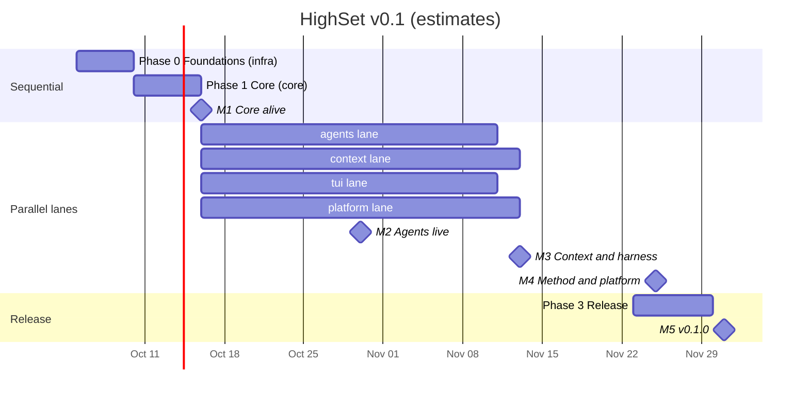

# HighSet roadmap

Status: Draft 1 · 2026-10-03. Dates assume the build starts Monday 2026-10-05 and that several builder agents run in parallel after M1. The owner confirmed an **8-week** plan with the full v0.1 scope (OQ-2, resolved).

## Strategy

"Core in sequence, independent modules in parallel" (Q13.4):

1. **Phase 0, Foundations** (lane `infra`): the repo, CI, config, logging, i18n, and the test harness with a fake agent.
2. **Phase 1, Core** (lane `core`): the domain model, storage, protocol, daemon, projects and tasks. **Contracts freeze at the end of Phase 1 (M1).**
3. **Phase 2, Parallel lanes.** Four builder agents, each owning one lane:
   - `agents`: git worktrees, adapters, sessions, attention, costs.
   - `context`: knowledge, packs, profiles, compiler, sync targets, MCP server, mentions, memory.
   - `tui`: the terminal UI.
   - `platform`: secrets, LLM layer, methodology, search, plugins, hooks, backups.
4. **Phase 3, Release** (lane `release`): performance verification, packaging, docs, dogfooding.

## Milestones

At each milestone, the builder writes a Spanish report (`docs/es/reportes/M<N>.md`) and stops for the owner's review. The owner reviews **behavior**, using the demo steps in [`es/revision-de-fases.md`](es/revision-de-fases.md).

### M1: Core alive (≈ 2026-10-16)

Tasks: P0-001…P0-006, P1-001…P1-007.

- The daemon starts on demand and survives clients closing.
- Workspaces, projects and tasks can be managed from the CLI; quick capture works.
- Caches rebuild from plain files; external edits are picked up.
- CI is green on macOS and Linux; the fake agent exists.

**Owner demo:**
1. Create a workspace and a project.
2. Add tasks and ideas, move them through statuses, edit one in `$EDITOR`.
3. Delete the cache and run `highset reindex`; nothing is lost.

### M2: Agents live (≈ 2026-10-30)

Tasks: A-001…A-005, A-008, A-009, C-001…C-004, D-001.

- Starting Claude Code on a task creates its own worktree and branch.
- The TUI shows the session live (ACP structured view or embedded terminal) on top of the IDE layout, palette and kanban.
- Permission requests and "agent finished" raise OS notifications; you approve from the TUI.
- Every session leaves a transcript and a diff, with secrets redacted.

**Owner demo:**
1. Run two Claude Code sessions in parallel on two tasks.
2. Close the TUI, reopen it, and find both still running.
3. Approve a permission request from the notification flow.

### M3: Context and harness (≈ 2026-11-13)

Tasks: B-001…B-010, A-006, A-007, D-002, D-004, D-007, C-007, C-009.

- Knowledge base with levels, audience and convention files, plus context packs.
- Profiles are layered global → workspace → project → task, with a central MCP server registry.
- The context compiler generates `CLAUDE.md`, `AGENTS.md`, Claude Code settings and Codex config. `highset context explain` shows what each agent sees.
- HighSet's MCP server is available to every agent. `@`-mentions work in the composer.
- Codex, opencode and Cursor CLI adapters work. The LLM provider layer, the methodology engine (flows and templates) and full-text search are in place.

**Owner demo:**
1. Write a private note visible only to Claude Code in one project.
2. Start Claude Code and Codex on the same project; check with `context explain` that only Claude sees the note.
3. Ask an agent to search project knowledge through MCP.

### M4: Method and platform (≈ 2026-11-25)

Tasks: A-010, B-011, B-012, D-003, D-005, D-006, D-008…D-011, C-005, C-006, C-008, C-010.

- The full feature flow: spec → gate → plan → gate → implement → checks plus reviewer agent → diff gate → PR.
- Session summaries, memory proposals and an approval inbox; staleness proposals.
- ADRs, changelog, journal, daily standup, weekly review.
- Costs with budgets and alerts; a dashboard with every agent across projects.
- Declarative plugins with permission approval; Claude Code plugin and Agent Skills import; hooks; backups; `highset doctor`.
- Complete Spanish translation.

**Owner demo:**
1. Take an idea from the Inbox to a merged PR using only gates and approvals.
2. Read the next morning's standup.
3. Install a plugin from GitHub and review its permissions.

### M5: v0.1.0 (≈ 2026-12-01)

Tasks: R-001…R-004.

- Performance budgets verified, with a report.
- Release pipeline: GitHub Releases on `github.com/evangutierrez-fin/highset`, Homebrew tap `evangutierrez-fin/homebrew-tap`, `cargo install`. MIT license.
- User guide in English and Spanish.
- HighSet manages its own remaining backlog (dogfooding).

**Owner demo:**
1. Install with `brew install`.
2. Follow the Spanish quickstart from scratch.
3. Use HighSet for a full day of work.

## Lanes and ownership

| Lane | Owns crates / folders | Task IDs |
|---|---|---|
| infra | `xtask`, `highset-testkit`, `tools/fake-agent`, `highset-i18n`, CI | P0-* |
| core | `highset-core`, `highset-protocol`, `highset-store`, `highset-daemon` skeleton, `highset-cli` skeleton | P1-* |
| agents | `highset-git`, `highset-agents`, `daemon/services/{sessions,attention,costs,git}` | A-* |
| context | `highset-context`, `highset-mcp`, `daemon/services/{knowledge,context,inbox}` | B-* |
| tui | `highset-tui` (+ Fluent strings for the TUI) | C-* |
| platform | `highset-secrets`, `highset-llm`, `highset-method`, `highset-search`, `highset-plugins`, `daemon/services/{llm,method,search,plugins,hooks,backup}` | D-* |
| release | packaging, perf, user docs | R-* |

The CLI command tree (`highset-cli`) is shared. Each lane adds its subcommands in its own module (`crates/highset-cli/src/commands/<area>.rs`).

## After v0.1

**v0.2 candidates:**

- Code plugins (out-of-process JSON-RPC).
- Knowledge graph view and graphify integration.
- Notion/Obsidian importers.
- External tracker sync (GitHub Issues, Linear).
- Scheduled automations.
- Harness A/B comparison.
- Sync providers.
- Gemini CLI adapter.
- Session resume after a daemon restart.
- Custom flow editor in the TUI.

**Later:**

- Public plugin registry.
- Semantic search (only if measurements justify it).
- Team features.
