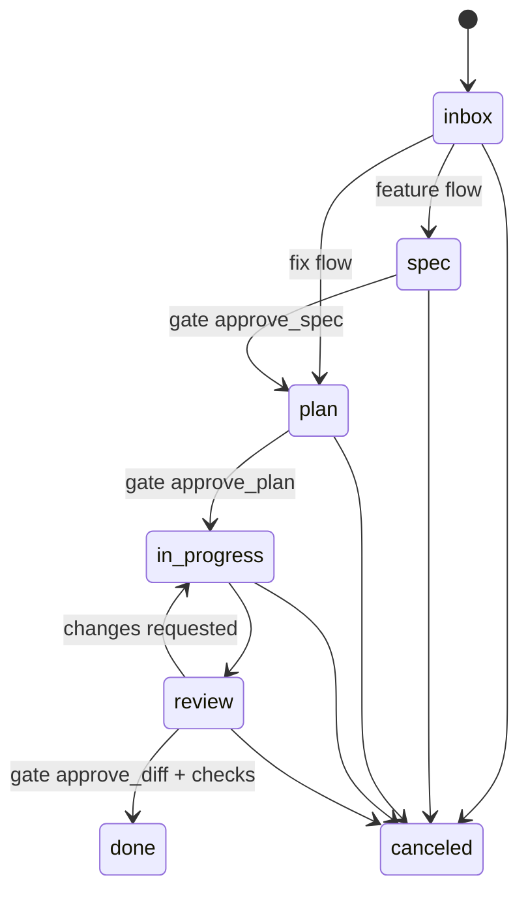

# Spec: core domain (`highset-core`)

Requirements: ORG-1…7, AGT-7, CTX-2/3, HRN-4, MTH-1/4. ADRs: 0002, 0007, 0011, 0013, 0020.

`highset-core` is the contract every other crate builds on. It has no async and no IO, except path resolution in `paths`. It **freezes at M1**: after that, additive changes only, unless an ADR says otherwise.

## 1. Identifiers

| Entity | Internal ID | Human ID | Notes |
|---|---|---|---|
| Workspace | `ws_<ulid>` | slug (`work`, `personal`) | Slug is unique globally |
| Project | `prj_<ulid>` | slug | Stored in `.highset/project.toml`, so it travels with the repo |
| Task | `tsk_<ulid>` | `T-0001` | Number = max(existing in project) + 1, allocated by the daemon (scan, no counter file, so merges stay safe) |
| Session | `ses_<ulid>` | short form `ses_…last6` in the UI | |
| Knowledge item | `kb_<ulid>` | slug (from the filename) | Slugs unique per level; more specific levels shadow less specific ones |
| Context pack | n/a | name (folder name) | |
| Profile | n/a | name (`builder`, `reviewer`) | |
| Attention item | `att_<ulid>` | n/a | Runtime only (SQLite), rebuilt from session state |
| Proposal | `prp_<ulid>` | n/a | File in `content/inbox/` |
| Plugin | n/a | `publisher.name` | |

IDs implement `Display`/`FromStr`, round-trip through serde as strings, and reject the wrong prefix.

## 2. Entities

Field lists are normative. Optional fields are `Option<_>`. Unknown fields read from files must be preserved on write; `highset-store` handles that, and core types carry a `extra: toml::Table`/`serde_yaml::Mapping` bag where noted.

### Workspace
`id, slug, name, created_at, config: ConfigLayer (optional), extra`

### Project
`id, slug, name, workspace: WorkspaceId, root: PathBuf (absolute, main checkout), linked_repos: Vec<PathBuf>, default_branch: Option<String>, flow_default: FlowId (default "feature"), verify: VerifyCommands, config: ConfigLayer, extra`

`VerifyCommands { test: Option<String>, lint: Option<String>, format: Option<String>, typecheck: Option<String>, extra: BTreeMap<String,String> }`

### Task
| Field | Type | Notes |
|---|---|---|
| `id` | `TaskId` | |
| `number` | `TaskNumber` | `T-0001` |
| `title` | `String` | |
| `flow` | `FlowId` | `feature` \| `fix` \| custom |
| `status` | `Status` | see §3 |
| `blocked` | `Option<String>` | reason; `None` = not blocked |
| `priority` | `Priority` | `urgent`, `high`, `medium` (default), `low` |
| `labels` | `Vec<String>` | |
| `epic` | `Option<String>` | free-form grouping key |
| `profile` | `Option<String>` | assigned profile |
| `agent` | `Option<AgentKind>` | preferred agent |
| `depends_on` | `Vec<TaskNumber>` | no cycles (validated) |
| `links` | `Vec<Link>` | `{kind: file\|commit\|pr\|issue\|url, target, title?}` |
| `packs` | `Vec<String>` | packs enabled for this task |
| `branch` | `Option<String>` | set when the worktree is created |
| `worktree` | `Option<PathBuf>` | |
| `spec_dir` | `Option<PathBuf>` | relative to repo, e.g. `specs/012-auth` |
| `gates` | `BTreeMap<GateId, GateRecord>` | `{state: pending\|approved\|rejected\|skipped, by, at, reason?}` |
| `cost` | `CostSummary` | cached aggregate (tokens in/out, usd?) |
| `created_at`, `updated_at` | `OffsetDateTime` | |
| `config` | `ConfigLayer` | task-level overrides (layer 4) |
| body | Markdown | description, acceptance criteria, notes |
| `history` | appended section in body | status changes and skipped gates with reasons (human-readable log) |

### Session
`id, task: Option<TaskId>, project: ProjectId, agent: AgentKind, mode: SessionMode (acp|pty|headless), profile: String, state: SessionState, started_at, ended_at?, exit: Option<ExitInfo>, worktree: PathBuf, protocol: Option<String> (e.g. ACP version), agent_version: Option<String>, bundle_hash: String, usage: UsageSummary`

`SessionState`: `starting → running ⇄ waiting_input | waiting_permission → ended(ok|error|canceled) | lost`

### KnowledgeItem
`id, slug, title, kind: KbKind, level: Level, tags, audience: Audience, source: Option<Source>, covers: Vec<Glob>, apply_to: Vec<Glob> (instructions only), asset: Option<PathBuf>, created_at, updated_at, body, extra`

`KbKind`: `doc`, `note`, `prompt`, `spec`, `snippet`, `reference` (web page/PDF text), `image`, `data`, `memory`, `instructions`, `skill`, `profile`, `project_overview`. Convention filenames map to kinds; see `knowledge.md`.

`Level`: `global`, `workspace(WorkspaceId)`, `project(ProjectId)`, `local(ProjectId)`.

`Audience { agents: Vec<AgentKind>, profiles: Vec<String>, tasks: Vec<TaskNumber> }`. Empty vectors mean "no restriction" on that axis. All non-empty axes must match (AND).

### ContextPack, Profile
Defined in `context-compiler.md` and `harness.md`. Core holds the plain data types.

### AttentionItem
`id, kind: permission|input_needed|session_finished|gate_pending|budget_alert|proposal_pending|hook_failed, session?, task?, project?, title, detail, options: Vec<AttentionOption>, created_at, resolved: Option<Resolution>`

### UsageRecord
`session, at, model: Option<String>, input_tokens, output_tokens, cache_read_tokens, cache_write_tokens, cost_usd: Option<f64>, source: adapter|harvester|llm_task`

### Proposal
`id, kind: memory|knowledge|decision|doc_update, title, body, target: Option<PathBuf>, provenance: {session?, task?, at}, state: pending|approved|rejected|edited`

## 3. Status machine and flows

Statuses: `inbox`, `spec`, `plan`, `in_progress`, `review`, `done`, `canceled`. `blocked` is a flag, not a status.



Rules (all enforced by `core::flow::validate_transition`):

- A `Flow` (loaded from TOML, see `methodology.md`) defines its statuses, transitions and gate requirements. Core ships the types and the validation logic; the flow files live in `highset-method`.
- **Actor-aware.**
  - `Actor::Human` may perform any transition the flow allows.
  - `Actor::Agent` (via MCP) may move only `* → review` (request review) and `review → in_progress` is human-only.
  - `Actor::Agent` can never approve gates, set `done`, or set `canceled`.
- **Guide strictness.** With `strictness = guide` (the default), a human transition that skips a pending gate is allowed with a reason. It is recorded as `GateRecord{state: skipped, reason}` and in `history`. With `strict`, it is rejected. With `info`, gates are advisory only.
- Moving backwards is always allowed for humans and is logged.

## 4. Events

`Event` is an enum, serialized as `{ "type": "task.moved", "at": …, "data": {…} }`. Topics are dot-separated prefixes used for subscriptions.

| Topic | Events |
|---|---|
| `workspace.*` | `created`, `updated`, `removed` |
| `project.*` | `added`, `updated`, `removed` |
| `task.*` | `created`, `updated`, `moved`, `gate`, `removed` |
| `session.*` | `started`, `state`, `event` (normalized `SessionEvent`), `output` (PTY bytes, never via the bus; served per-attachment), `ended` |
| `attention.*` | `raised`, `resolved` |
| `kb.*` | `changed`, `removed` |
| `context.*` | `compiled`, `synced` |
| `usage.*` | `recorded`, `budget_alert` |
| `inbox.*` | `proposed`, `resolved` |
| `plugin.*` | `installed`, `updated`, `removed` |
| `hook.*` | `ran`, `failed` |
| `daemon.*` | `ready`, `shutting_down` |

## 5. `ContextBundle` (intermediate representation)

This is the agent-neutral output of the context compiler, consumed by emitters (`highset-context`) and by adapters at launch (`highset-agents`). It lives in core so neither of those crates depends on the other.

```rust
pub struct ContextBundle {
    pub hash: String,                    // stable hash of all inputs
    pub target: BundleTarget,            // { project, task?, profile, agent }
    pub model: Option<ModelSpec>,        // provider:model + params
    pub instructions: Vec<InstructionBlock>, // ordered; each has title, body, provenance, apply_to globs
    pub skills: Vec<SkillRef>,           // path to SKILL.md folder + name + description
    pub commands: Vec<PromptCommand>,    // reusable prompts / slash commands
    pub subagents: Vec<SubagentSpec>,
    pub mcp_servers: Vec<McpServerSpec>, // always includes "highset"
    pub permissions: PermissionSet,      // allow/deny rules in HighSet's neutral syntax
    pub hooks: Vec<AgentHookSpec>,       // agent-native hooks to install (e.g. notify bridge)
    pub env: Vec<EnvVar>,                // values may be SecretRef (resolved only at launch)
    pub attachments: Vec<Attachment>,    // inline context for the initial prompt (spec, plan, pack docs, mentions)
    pub on_demand: Vec<OnDemandEntry>,   // index of items fetchable via MCP (id, title, kind, size)
    pub provenance: Vec<ProvenanceEntry>,// every included/excluded item with reason
}
```

Neutral permission syntax (compiled per agent in `harness.md`):

```
allow: ["read:**", "edit:**", "bash:cargo *", "bash:git status", "mcp:highset/*"]
deny:  ["edit:.highset/**", "bash:git push *", "read:.env*", "net:*"]
```

## 6. Configuration model

`ConfigLayer` is a TOML table with a typed view (`Config`). There are four layers, merged in this order: **global → workspace → project → task** (HRN-4).

Merge rules:

- Tables merge deeply.
- Scalars and arrays are replaced by the more specific layer.
- An array can be extended instead of replaced with the `+key = [...]` syntax. Example: `+mcp.enabled = ["github"]` adds to the inherited list.
- Every resolved value keeps its source (`Origin { layer, path, line }`) so `highset config show --resolved` and `context explain` can annotate it.

Top-level config sections (typed; unknown keys are warned about, not rejected):

`[ui]`, `[keys]`, `[agents.<kind>]`, `[sync]`, `[context]`, `[llm]`, `[costs]`, `[method]`, `[git]`, `[notifications]`, `[search]`, `[backup]`, `[hooks]`, `[paths]`.

## 7. Paths (`highset_core::paths`)

- `home()`: `$HIGHSET_HOME` or `~/.highset`.
- `content_dir()`: `config.paths.content_dir`, or `$HIGHSET_CONTENT_DIR`, or `home()/content`.
- `state_dir()`: `config.paths.state_dir`, or `$HIGHSET_STATE_DIR`, or `home()/state`. It must not be inside `content_dir` (error).
- `worktrees_dir()`: `config.git.worktrees_dir` or `home()/worktrees`.
- `socket_path()`: `state_dir()/run/highset.sock`.
- `find_project_root(cwd)`: walk up to the first directory that contains `.highset/project.toml`.

## Verified facts

_(Builder: record facts confirmed during implementation here, with date and source.)_
